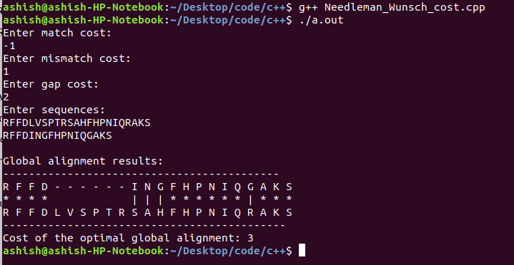
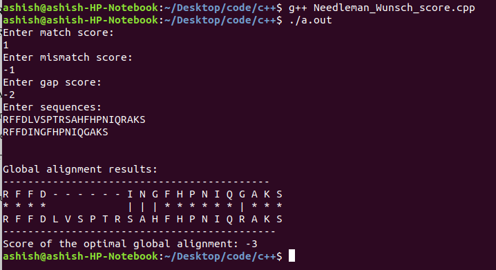
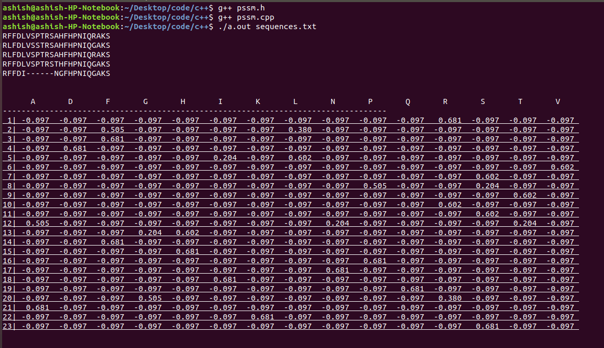
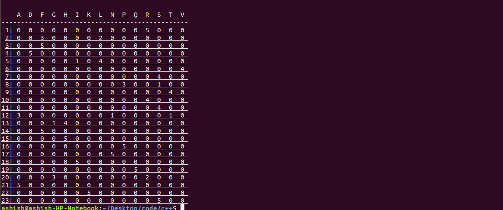
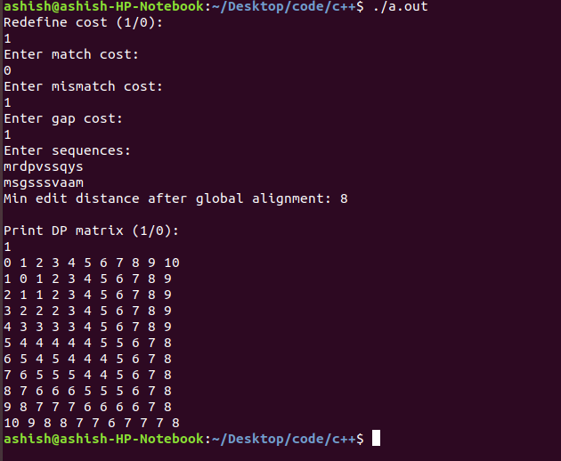
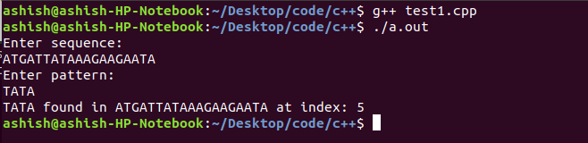
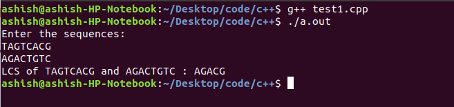
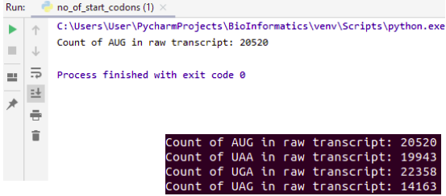
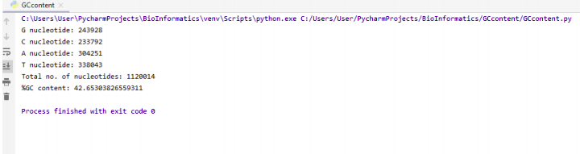

# WWOX gene analysis

BioInformatics Project - Anlysis of WWOX gene. The project is prepared for the partial fulfillment of the couse Intro. to Bioinformatics (BIO F242) in BITS Pilani, Pilani campus.

The project contains an extensive analysis of the WWOX gene loci.

## Objective
* Perform extensive analysis of WWOX gene loci using various pre-manufactured bioinformatics tools
* Replicate some of the well known algorithms and apply at a smaller sequence

## Contents:- 

### *<ins>[Needleman Wunsch Global alignment](Needleman%20Wunsch%20Global%20alignment)</ins>* using DP matrix
* Implementation of algorithm to perform pairwise Needleman-Wunsch global alignment using DP.
* Global alignment is used to -
  * Detect similarity between 2 sequences
  * Estimate the time of divergence of 2 sequences using ML models.
* Cost minimiation: 
* Score maximisation: 

### *<ins>[PSSM](PSSM)</ins>* matrix generation
* Implementation to generate PSSM matrix of multiple aligned sequences using DP
* 
* 

### *<ins>[Edit distance](Edit%20distance)</ins>* DP matrix
* Implementation of customized Edit distance algorithm using DP.
* Edit distance gives us the minimum number of edits required to make the LCS of the 2 sequences = Number of characters in the 2 sequences
* The scoring scheme for the match/mismatch/gap can be changed.
* A measure of sequence similarity in sequence analysis studies.
* 

### *<ins>[DNA pattern extraction](DNA%20pattern%20extraction)</ins>* using KMP string search algorithm
* Apply linear time complexity KMP string search algorithm
* Applied to detect unusual or known string sequences in a longer DNA/Protein sequnce
* Motif Search in a sequence
* 

### *<ins>[Sequence alignment LCS](Sequence%20similarity%20LCS)</ins>* using Longest Contiguous Subsequence using DP
* Apply LCS algorithm to find common subsequence and measure the similarity of a sequence pair.
* Sequence comparison is ideal for providing solutions to many biological questions
  * Predicting structure and function of proteins
  * Identification of common motifs
  * Sub problem in DNA sequencing
* 
  
### Sub-tasks 
* *<ins>[Amino acid count](Amino%20acid%20count)</ins>* Perform individual amino acid count by linear search.
* *<ins>[Codon count](Codon%20count)</ins>* of any codon in the raw transcript (DNA->RNA).
* 
* *<ins>[Dot Plot](Dot%20Plot)</ins>* of a FASTA nucleotide sequence using pylab.
* *<ins>[GCcontent](GCcontent)</ins>* of a nucleotide sequence.
* 
* *<ins>[Reverse compliment](Reverse%20Compliment)</ins>* of a nucleotide sequence to find non-template sequence of a template in DNA
* *<ins>[Raw transcript](raw%20transcript)</ins>* of a DNA sequence to convert it into tranlable RNA sequence

## Tasks-
- [X] Implement Needleman-Wunsch algorithm
- [X] Implement algorithm to generate PSSM matrix
- [X] Calculate Edit distance b/w 2 refseq using DP matrix
- [X] Sequence comparison using LCS.
- [X] DNA Pattern matching using KMP
- [X] Find GC content in WWOX gene
- [X] Find GC content in RefSeq transcripts
- [X] Find amino acid count in RefSeq proteins
- [X] Amino acid frequency in RefSeq proteins
- [X] End Term project

## Built using 
 * PyCharm
 * Python 3
 * BioPython
 * pylab
 * numpy
 * pandas
 * matplotlib
 * g++ version 7.5.0
 * vim text editor
